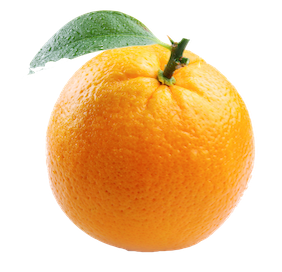

Oranges are juicy, citrus fruits known for their vibrant color and refreshing sweetness with a hint of tang. Rich in vitamin C and other antioxidants, they’re a delicious way to boost your immune system while brightening your day. Whether peeled and eaten fresh, squeezed into juice, or zested for flavor in cooking, oranges bring a burst of sunshine to kitchens and tables around the world.

